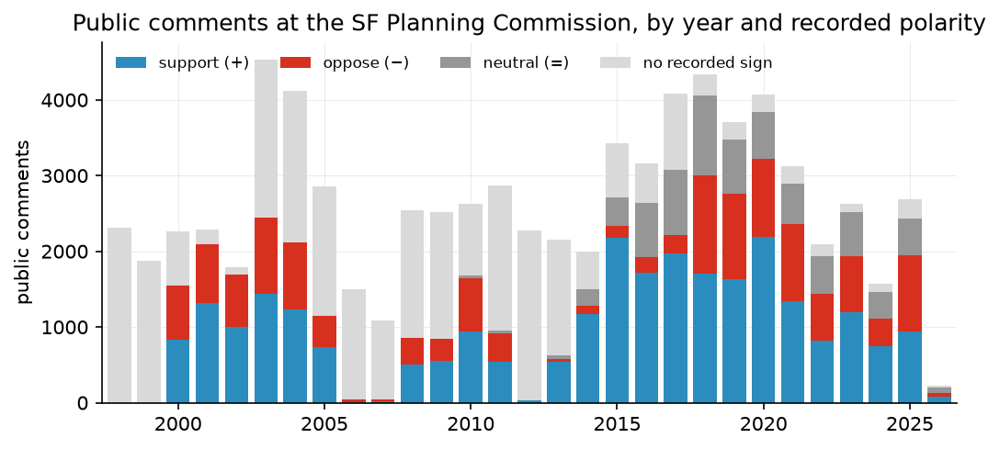
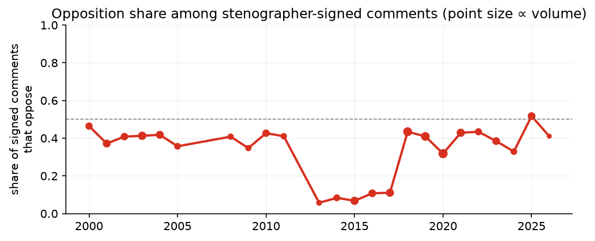
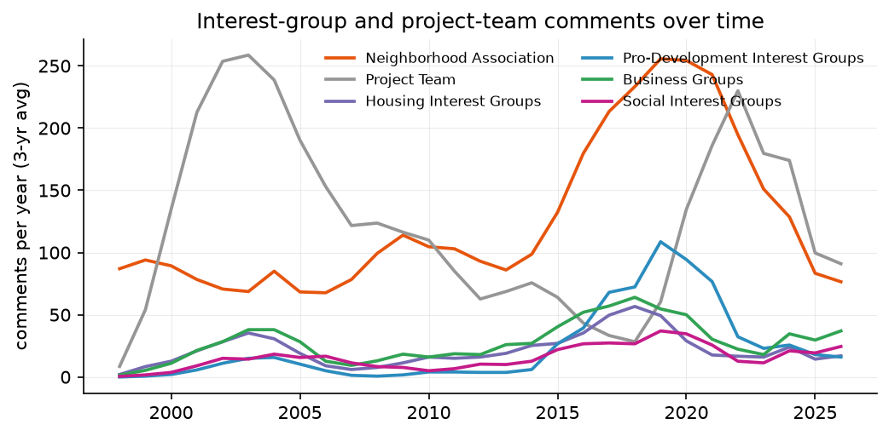
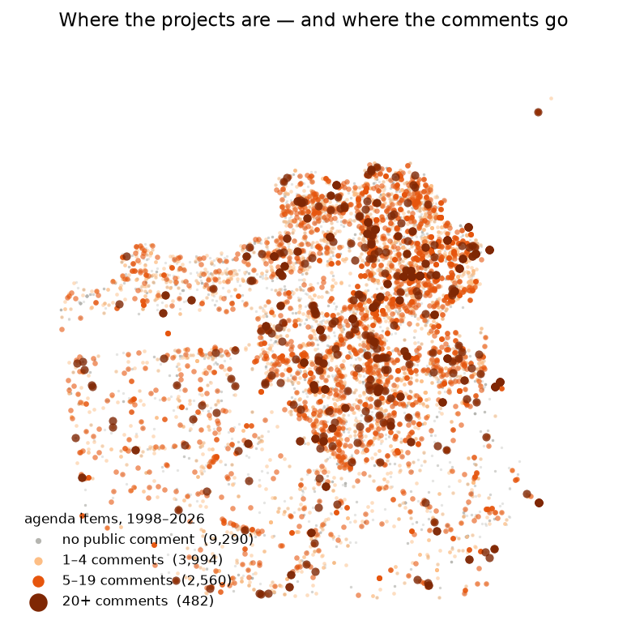

# San Francisco Planning Commission Public Comment Data, 1998–2026

This dataset parses **every San Francisco Planning
Commission meeting's minutes from January 1998 to July 2026** into
structured records: agenda items with staff recommendations and commission
actions, and each public comment with the speaker's name, recorded polarity
(support / oppose / neutral), the stenographer's summary of what they said,
and the speaker's role or organizational affiliation. Items are joined to
San Francisco Planning Department project records (unit counts, uses,
locations).

**Current coverage:** 1,252 meetings · 25,560 agenda items · 76,731 public
comments · 24,878 unique speakers · January 1998 – March 2026. Updated
periodically as new minutes are posted.

## The data at a glance

Grey reflects the minutes themselves, not parsing gaps: 1998–2004 minutes
mostly list speaker names only; 2006–08 minutes summarize comments in
transcript style without polarity notations; and 2009–2012 minutes list
names without signs or summaries. The secretary's systematic +/−/= notation
begins in 2005 and is standard from 2013 on. A classifier imputes polarity
for unsigned comments that have text (separate columns, never overwriting
the stenographer).

Comments from registered neighborhood associations dominated the 2010s
boom-era hearings, while pro-development (YIMBY/SPUR) commenting emerges
almost from nothing after 2015.

Regenerate with `python pipeline/make_figures.py`.

This dataset extends and rebuilds the data used in:

> Sahn, Alexander. 2025. "Public Comment and Public Policy."
> *American Journal of Political Science* 69(2): 685–700.
> https://doi.org/10.1111/ajps.12900

**It is not the replication archive for that article** — the exact data and
code behind the published results are permanently archived at the
[AJPS Dataverse](https://doi.org/10.7910/DVN/WZOC7H). This repository is a
successor build: the time series runs through the present rather than March
2022, every meeting was re-scraped and re-parsed with a new pipeline, and
several bugs in the original data were corrected.

## The data (`public/`)

| file | unit | contents |
|---|---|---|
| `meetings.csv` | meeting | date, type, start/adjournment times, staff & commissioner attendance rosters, source URL |
| `items.csv.gz` | agenda item | section, case number & entitlement type, full item text, staff recommendation, commission action, votes, coded outcomes (approve / approve w. conditions / disapprove / continuance / withdraw / no action), project attributes from DataSF (units, uses, address), parcel coordinates |
| `comments.csv` | public comment | speaker name (raw + cleaned), title, role/organization, interest-group classification, polarity (stenographer-recorded, role-implied, or model-imputed — flagged by source), comment summary, extraction method |
| `staff_tenure.csv` | staff member | Planning Department staff panel from Wayback Machine directory snapshots, 2011–2026 |
| `name_crosswalk.csv` | name pair | applied and candidate name merges, for record linkage |
| `codebook.md` | — | full variable documentation |

`items.csv.gz` reads directly with `pandas.read_csv("items.csv.gz")` or
`readr::read_csv("items.csv.gz")`.

## Sources

- **Minutes:** [SF Planning CPC hearing archives](https://sfplanning.org/cpc-hearing-archives)
  (2019–present PDFs; 2015–2018 sfgov.org archive pages; 1998–2014 via the
  mirrored legacy site on S3).
- **Projects:** DataSF, [Planning Department Records – Projects](https://data.sfgov.org/Economy-and-Community/Planning-Department-Records-Projects/qvu5-m3a2).
- **Geocoding:** DataSF, [Addresses with Units – EAS](https://data.sfgov.org/Geographic-Locations-and-Boundaries/Addresses-with-Units-Enterprise-Addressing-System/ramy-di5m)
  (parcel centroids and address points; no commercial geocoder used).
- **Staff panel:** Wayback Machine snapshots of the Planning Department
  staff directory.

Polarity signs are the commission secretary's own +/−/= notations where
recorded (systematic from ~2005). For unsigned comments with text, a
classifier trained on the 45k stenographer-signed comments imputes polarity
(held-out accuracy 0.93 at the acceptance threshold); imputed values are in
separate columns and flagged by `sign_source`. See `public/codebook.md`.

## Citing

Please cite the AJPS article (above) and this dataset; see `CITATION.cff`.

## License

Code: MIT. Data: CC BY 4.0. The underlying minutes and administrative
records are public documents of the City and County of San Francisco.
